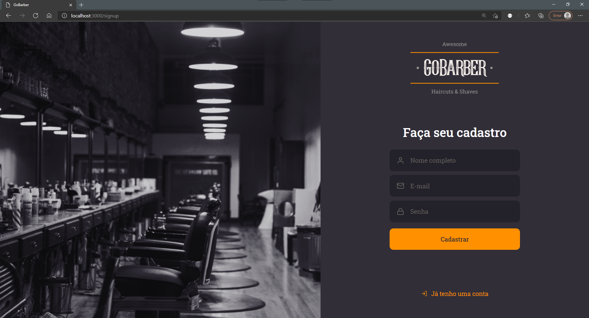
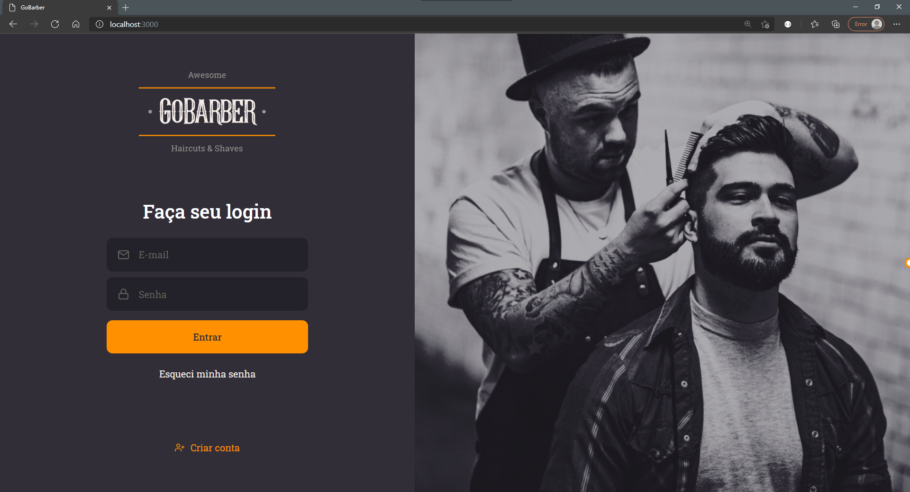

<!-- BADGES -->
<p align="center">
  
  
  
  
  
  <a href="https://www.linkedin.com/in/jvitormf/">
    
  </a>
</p>
<br/>

<!-- PROJECT LOGO -->
<p align="center">
  <a href="https://github.com/jvitormf/rs-bc-gs11-gobarber">
     
  </a>

Gobarber it's a fictitious barbershop app created by [Rocketseat](https://rocketseat.com.br/) in order to teach its students how to create an entire application from scratch, using Node.js, React and React Native during the [Bootcamp](https://rocketseat.com.br/gostack) GoStack.
</p>

***

<!-- TABLE OF CONTENTS -->
# Table of Contents
* [About the Project](#boom-about-the-project)
  * [Built With](#gear-built-with)
    * [Tools](#tools)
    * [Technologies](#Technologies)
* [Layout](#fireworks-layout)
* [Getting Started](#rocket-getting-started)
  * [Prerequisites](#clipboard-prerequisites)
  * [Installation](#zap-installation)
* [License](#memo-license)
* [Contributing](#bulb-contributing)
* [Contact](#e-mail-contact)
* [Acknowledgements](#exclamation-acknowledgements)
<!-- * [Usage](#usage)
* [Roadmap](#arrows_clockwise-roadmap) -->

<!-- ABOUT THE PROJECT -->
# :boom: About The Project

<!-- Project image -->

<p>
  This app is created to help barbers to manage appointments for their clients
</p>


# :gear: Built With
  ## Tools
  * [VSCode](https://code.visualstudio.com/)
  * [Docker](https://www.docker.com/)
  * [Yarn](https://yarnpkg.com/)
  * [Insomnia](https://insomnia.rest/)
  * [DBeaver](https://dbeaver.io/)

  ## Technologies
  * [Node.js](https://nodejs.org/)
  * [React](https://reactjs.org/)
  * [React Native](https://reactnative.dev/)

  [:arrow_up: Back to top](#table-of-Contents)


  # :fireworks: Layout
<!-- * Click [here](https://www.figma.com/file/cg1MIzSRRss8ggpypQbmdD/AluraQuiz?node-id=0%3A1) to see the web layout of this app. -->

<!--  -->


[:arrow_up: Back to top](#table-of-Contents)

<!-- GETTING STARTED -->
# :rocket: Getting Started

To get a local copy up and running follow these simple steps.

[:arrow_up: Back to top](#table-of-Contents)

## :clipboard: Prerequisites

* Node.js - [Install guide](https://nodejs.org/en/download/package-manager/)
* Yarn - [Install guide](https://classic.yarnpkg.com/en/docs/install/)

[:arrow_up: Back to top](#table-of-Contents)

## :zap: Installation
Run the commands below to install and run the app.
  ```sh
    #Clone the project
    git clone https://github.com/jvitormf/rs-bc-gs11-gobarber
  ```

  ```sh
    #Go to backend folder
    cd rs-bc-gs11-gobarber/backend

    #Install dependencies
    yarn

    #Start the server
    yarn dev
   ```
  ```sh
    #Go to frontend folder
    cd rs-bc-gs11-gobarber/frontend

    #Install dependencies
    yarn

    #Start the server
    yarn start
   ```
  ```sh
    #Go to mobile folder
    cd rs-bc-gs11-gobarber/mobile

    #Install dependencies
    yarn

    #Start the server
    yarn start
   ```

[:arrow_up: Back to top](#table-of-Contents)

<!-- CONTRIBUTING -->
# :bulb: Contributing

Any contributions you make are **greatly appreciated**.

1. Fork the Project
2. Create your Feature Branch (`git checkout -b feature`)
3. Commit your Changes (`git commit -m 'Add some Feature`)
4. Push to the Branch (`git push origin Feature`)
5. Open a Pull Request

[:arrow_up: Back to top](#table-of-Contents)

<!-- USAGE EXAMPLES -->
<!-- # Usage

Use this space to show useful examples of how a project can be used. Additional screenshots, code examples and demos work well in this space. You may also link to more resources.

_For more examples, please refer to the [Documentation](https://example.com)_ -->


<!-- LICENSE -->
# :memo: License

Distributed under the MIT License. See [LICENSE](LICENSE.md) for more information.

[:arrow_up: Back to top](#table-of-Contents)


<!-- CONTACT -->
# :e-mail: Contact

João Vitor - <j.vitor.mf@gmail.com>

LinkedIn - <https://www.linkedin.com/in/jvitormf/>


<!-- ACKNOWLEDGEMENTS -->
# :exclamation: Acknowledgements

* [Rocketseat GoStack Bootcamp](https://rocketseat.com.br/gostack)
